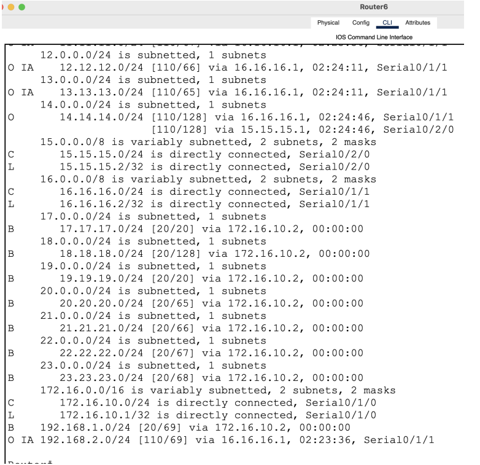
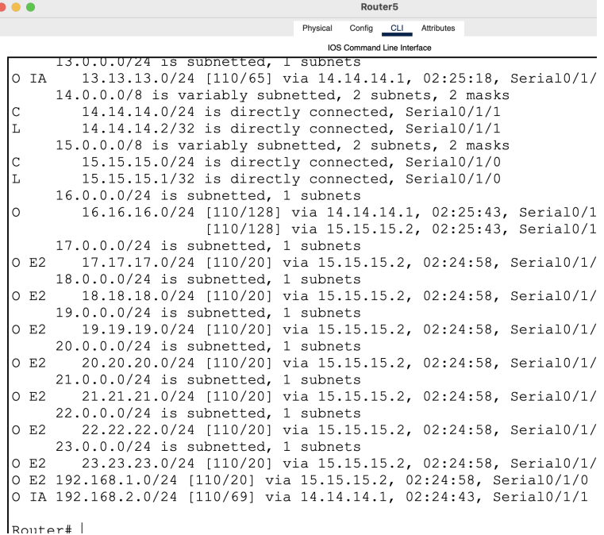
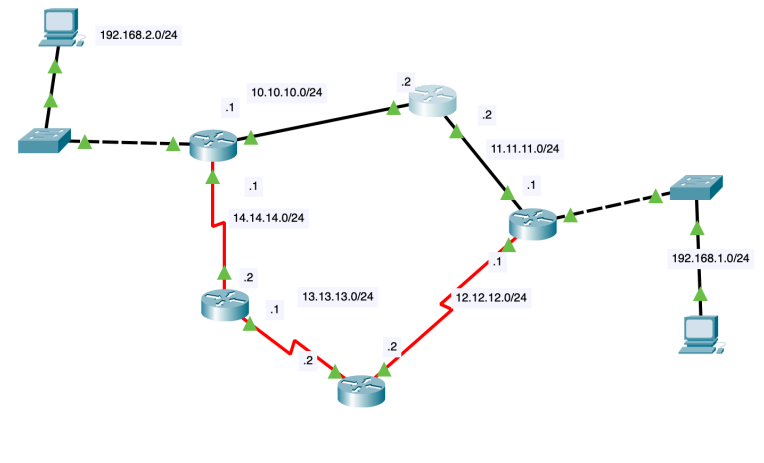
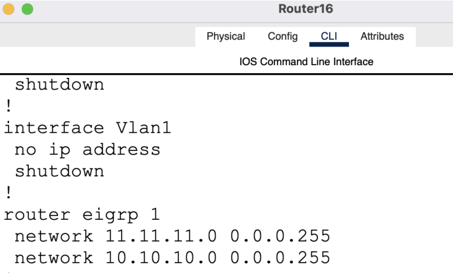
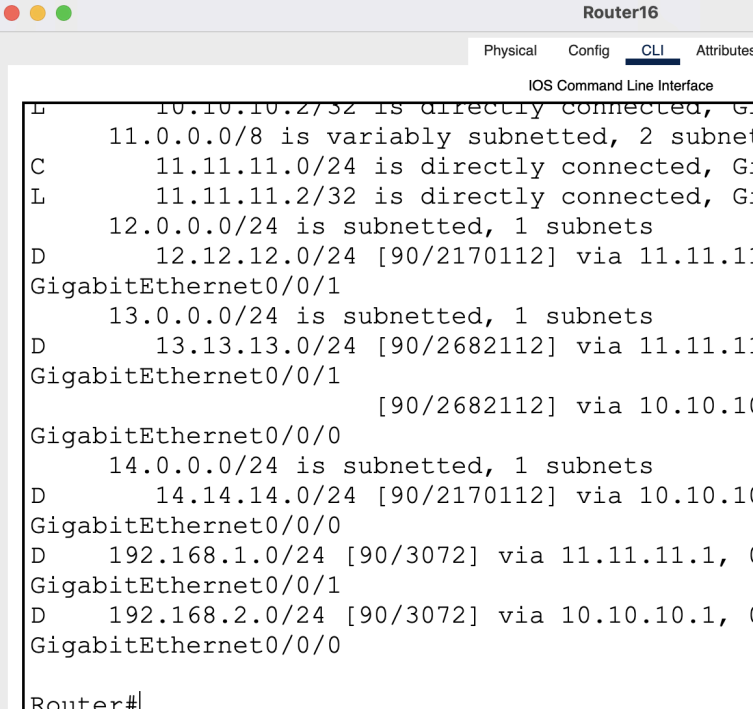

## INTRODUCTION :

During air5, we studied the OSPF protocol and set up a lab on Packet Tracer to manipulate this protocol and explore all its aspects. We had to set up two AS, each containing several OSPF areas with multiple routers. Computers are also connected to test our network. We were also instructed not to connect all the areas directly to the backbone area 0. Therefore, we illustrated the term "virtual-link" between two routers (a virtual link between a router at the edge of area 0 and the router at the edge of the area to be connected). Subsequently, we had to connect our two AS via the BGP protocol and redistribute the routes learned via BGP into OSPF. Once the routes were learned and the packets were correctly transiting from one AS to another, we were asked to explore and test the EIGRP protocol, which is similar to OSPF with some differences. I will attempt to demonstrate everything mentioned below.

## WHAT IS OSPF ?

OSPF is a dynamic link-state routing protocol (LSR) (it intelligently learns routes to its neighbors). It is an "open" protocol that can run on non-Cisco equipment. This protocol uses Dijkstra's algorithm or SPF (Shortest Path First) and thus allows defining and using the best path to the IP address to be reached.

### Cost Calculation

Each link has a weight, and the one with the lowest weight will be selected. **Weight (or Cost) $= 10^8 /$ link bandwidth in bits per second.**

#### Example

- A link with a bandwidth of $10 Mbps$:
    - **Cost = $10^8 / 10 Mbps = 10^7$**
- A link with a bandwidth of $1 Gbps (1000 Mbps)$:
    - **Cost = $10^8 / 1000 Mbps = 10^5$**

### In a routing table

When executing the `show ip route` command in a router, for the routes learned via OSPF (`O` at the beginning of the line), you will see the column $110/20$.
- $110$ est l’identifiant du processus OSPF (distance administrative)
- $20$ est le coût du chemin OSPF pour atteindre la destination

It should also be kept in mind that OSPF selects only the best routes in its routing table but keeps knowledge of other routes and paths to reach the destination. It maintains an internal database of the entire topology.

### Operation

1. **Declare OSPF on a router**
2. **Specify the networks you want to declare and share** (networks to which the router is connected)
3. **Specify the inverse mask and the area**

#### Definition of Area

An area is a hierarchical zone allowing the subdivision of OSPF within an AS. Each router then takes care of its area (LSA updates are internal to an area). Each area must be connected to area 0, which is the backbone. Inter-area communication is done with ABR (Area Border Router) routers.

4. **Designated Router (DR) in each area**

In each area, there is a designated router (DR), only for multi-access networks, where several routers are on the same network segment. In a point-to-point network, there is no need for a DR.

- **Role of the DR**: simplify and optimize OSPF communication on networks where several routers are connected to the same segment. Rather than having each router exchange information with all other routers, the routers elect a DR responsible for communicating with all other routers on the same segment.

  - **DR Election**: is done with the router having the highest priority (0 to 255); in case of a tie between two routers, the one with the lowest ID will be selected.

5. **OSPF communication between routers via HELLO packets**

  - **HELLO packet**: these packets are sent between routers by default every 10 seconds. They contain various important information such as router priority, the networks it wants to share, the DR, the Backup DR, its neighbors. These packets allow adjacency between two routers.

6. **LSA packet exchange**

  - **LSA (Link State Advertisement)**: packets containing important information about the network, router ID, interface status, priority, etc., and allowing each router's LSDB to be updated when a change occurs in the network.
  - **LSDB (Link State Data Base)**: internal database of each router containing the entire topology of the router's area network. It is regularly updated using LSA packets.

## EIGRP

It is a proprietary Cisco protocol. It uses the DUAL (hybrid) method; it is both a distance-vector and link-state protocol.

## RIP

It is a distance-vector protocol that calculates the best path solely based on hop count.

## BGP

It is the protocol used by two border routers of different AS to communicate the routes known by each router. Thanks to this protocol and by redistributing what is learned by BGP into OSPF, neighboring routers can know the routes learned via BGP and communicate with the other AS. (EBGP / IBGP, for external and internal)

## LABOS

- **AS 100 on the left with 3 OSPF areas 1**
  - **Area 0** is in the center, and the other two are directly connected to it.

- **AS 200 on the right with 3 OSPF areas 2**
  - **Area 0** is on the right, and only area 1 is directly connected to it. Area 2 on the left will have to pass through another area to access it, hence a virtual link.

### BGP communication between the two AS border routers:

- Declare your neighbor from the neighboring AS.
- Redistribute OSPF into BGP so that the learned subnets are shared..

- In OSPF, redistribute BGP so that the learned routes are shared.

By running a `show ip route` command on the border router, you can see that the neighboring AS routes have been shared and learned.

On another router, you can see that the neighboring AS routes have been learned via OSPF thanks to the BGP redistribution into OSPF on the border router.

Now, within AS 200, we have a **virtual-link** between the router connecting area 2 to area 1 and the router connecting area 0 to area 1. This virtual-link is a virtual link between the two areas (2 and 0) through area 1.

### Virtual link in OSPF

Here is the virtual link in OSPF on the two routers. Specify the area through which to transit, here area 1 because it is between the two. Then specify the router ID you want to reach.

Once this link is established and functional, the routers talk OSPF correctly with each other and can exchange routes.

### Network topology with the EIGRP protocol

The configuration is very simple, you just need to declare the subnets to which the router is connected with the inverse mask on each router, and the routing can be done.

The `show ip route` command shows:
- `D` => route learned via EIGRP

